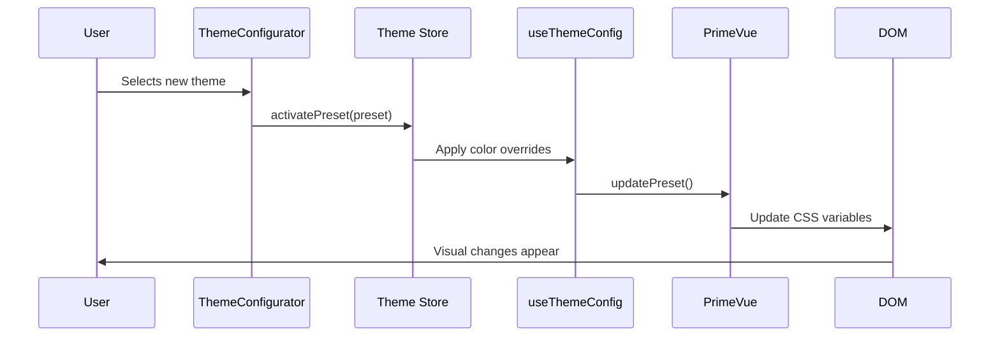
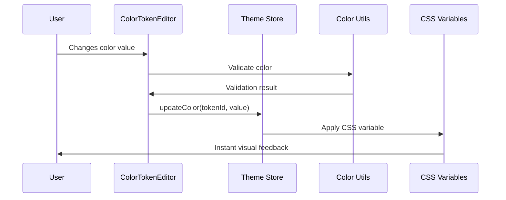

# 🎨 Triton Theme Configuration System - Technical Documentation

## Table of Contents
1. [Overview](#overview)
2. [Architecture](#architecture)
3. [File Structure](#file-structure)
4. [Core Components](#core-components)
5. [Data Flow](#data-flow)
6. [API Reference](#api-reference)
7. [User Guide](#user-guide)
8. [Developer Guide](#developer-guide)
9. [Extension Points](#extension-points)
10. [Troubleshooting](#troubleshooting)

---

## Overview

The Triton Theme Configuration System is a comprehensive, real-time theme customization solution built for Vue 3 applications using PrimeVue 4. It provides users with the ability to customize every aspect of their application's visual appearance through an intuitive interface while maintaining type safety and performance.

### Key Features
- **Real-time theme editing** with instant visual feedback
- **Multi-format color editing** (Hex, RGB, HSL) with validation
- **Preset management** with CRUD operations
- **Color harmony generation** (monochromatic, complementary, triadic, analogous)
- **Import/export functionality** for theme sharing
- **Dark mode with smooth transitions** using View Transitions API
- **Accessibility support** with high contrast themes and WCAG compliance
- **Cross-tab synchronization** for consistent experience
- **Type-safe architecture** with comprehensive TypeScript support

### Technical Stack
- **Vue 3** with Composition API
- **Pinia** for state management
- **PrimeVue 4** (Styled Mode) with design tokens
- **TypeScript** for type safety
- **LocalStorage** for persistence
- **CSS Variables** for real-time updates

---

## Architecture

### System Architecture Diagram

```mermaid
graph TD
    A[User Interface] --> B[ThemeConfigurator.vue]
    B --> C[Theme Store (Pinia)]
    C --> D[Preset Manager]
    C --> E[Theme Config Composable]
    C --> F[Color Editor Composable]
    
    D --> G[Storage Utils]
    D --> H[Validation Utils]
    
    E --> I[PrimeVue Theme System]
    F --> J[Color Utils]
    
    I --> K[CSS Variables]
    K --> L[Live UI Updates]
    
    G --> M[LocalStorage]
    H --> N[Theme Validation]
    
    O[Dark Mode Composable] --> P[View Transitions API]
    O --> K
```

### Core Principles

1. **Separation of Concerns**: Each module has a single responsibility
2. **Reactive Updates**: Changes propagate automatically through the system
3. **Type Safety**: Comprehensive TypeScript coverage
4. **Performance**: Minimal re-renders and efficient storage
5. **Extensibility**: Modular design for easy enhancement
6. **User Experience**: Intuitive interface with immediate feedback

---

## File Structure

```
src/
├── components/
│   └── theme/
│       ├── ThemeConfigurator.vue      # Main theme configuration interface
│       ├── ColorTokenEditor.vue       # Individual color token editing
│       ├── PresetManager.vue          # Preset CRUD operations
│       ├── PresetGrid.vue            # Visual preset display
│       ├── ThemePreview.vue          # Live theme preview
│       └── ThemeExporter.vue         # Import/export functionality
├── stores/
│   └── theme.store.ts                # Central theme state management
├── themes/
│   ├── presets/
│   │   ├── preset.types.ts           # TypeScript type definitions
│   │   └── preset-manager.ts         # Preset management logic
│   ├── config/
│   │   └── theme.config.ts           # Theme configuration and tokens
│   ├── composables/
│   │   ├── useThemeConfig.ts         # Theme configuration composable
│   │   └── useColorEditor.ts         # Color editing composable
│   └── utils/
│       ├── storage.ts                # Storage utilities
│       ├── validation.ts             # Validation utilities
│       └── color-utils.ts            # Color manipulation utilities
├── composables/
│   └── useDarkMode.ts                # Dark mode management
└── main.ts                           # Theme system initialization
```

---

## Core Components

### 1. ThemeConfigurator.vue
**Main orchestration component that provides the primary user interface.**

#### Key Features:
- Drawer-based interface (420px width)
- Real-time preset switching
- Base theme selection (Material, Aura, Lara, Nora)
- Tabbed color token editor
- Color harmony tools
- Configuration preferences
- Import/export access

#### Props: None (uses global theme store)

#### Events:
- None (communicates through store)

#### Key Methods:
```typescript
onPresetChange(event: any) // Handles preset selection
onBaseThemeChange() // Switches base theme
updateTokenColor(tokenId: string, value: string) // Updates color tokens
resetToken(tokenId: string) // Resets token to default
applyColorHarmony(type: string) // Applies color harmony scheme
```

### 2. ColorTokenEditor.vue
**Advanced color editing component with multi-format support.**

#### Props:
```typescript
interface Props {
  token: ColorToken          // Token definition
  value: string             // Current color value
  isEdited?: boolean        // Whether token has been modified
}
```

#### Events:
```typescript
interface Emits {
  update: [tokenId: string, value: string]  // Color value changed
  reset: [tokenId: string]                  // Reset to default
  edit: [tokenId: string]                   // Open detailed editor
}
```

#### Key Features:
- Visual color swatch display
- Multi-format editing (Hex, RGB, HSL)
- Real-time validation
- Quick color presets (24 colors)
- Color variations (lighter/darker)
- Copy to clipboard functionality

### 3. PresetManager.vue
**Comprehensive preset management interface.**

#### Props:
```typescript
interface Props {
  visible: boolean  // Dialog visibility
}
```

#### Events:
```typescript
interface Emits {
  'update:visible': [visible: boolean]
  'preset-changed': []
}
```

#### Key Features:
- Tabbed interface (All/Built-in/Custom)
- CRUD operations for presets
- Edit dialog with metadata
- Import/export functionality
- Storage statistics display

### 4. PresetGrid.vue
**Visual display component for theme presets.**

#### Props:
```typescript
interface Props {
  presets: ThemePreset[]     // Presets to display
  activePresetId?: string    // Currently active preset
  showEmptyState?: boolean   // Show empty state message
}
```

#### Events:
```typescript
interface Emits {
  activate: [preset: ThemePreset]
  edit: [preset: ThemePreset]
  duplicate: [preset: ThemePreset]
  delete: [preset: ThemePreset]
  create: []
}
```

#### Key Features:
- Responsive grid layout (1-3 columns)
- Color preview swatches
- Context menus for actions
- Status indicators (active, default, built-in)

---

## Data Flow

### Theme Change Flow



### Color Edit Flow



---

## API Reference

### Theme Store (Pinia)

#### State
```typescript
interface ThemeState {
  config: ThemeConfig                    // Theme configuration
  state: ThemeState                      // UI state
  presets: ThemePreset[]                 // All available presets
  activePreset: ThemePreset | null       // Currently active preset
  editingPreset: ThemePreset | null      // Preset being edited
  editingColors: ColorOverride[]         // Color modifications
}
```

#### Computed Properties
```typescript
availablePresets: ComputedRef<ThemePreset[]>  // Built-in + user presets
userPresets: ComputedRef<ThemePreset[]>       // User-created presets
builtInPresets: ComputedRef<ThemePreset[]>    // Built-in presets
canSave: ComputedRef<boolean>                 // Can save current changes
isConfigOpen: ComputedRef<boolean>            // Configuration panel open
```

#### Actions
```typescript
// Initialization
initialize(): Promise<void>

// Preset Management
activatePreset(preset: ThemePreset): Promise<void>
createPreset(name: string, description?: string): Promise<ThemePreset>
updatePreset(preset: ThemePreset): Promise<void>
deletePreset(presetId: string): Promise<void>
duplicatePreset(presetId: string, newName: string): Promise<ThemePreset>

// Color Management
updateColor(tokenId: string, value: string): Promise<void>
getTokenValue(tokenId: string): string

// Theme Application
applyTheme(): Promise<void>

// Import/Export
exportPreset(presetId: string): Promise<void>
importPreset(file: File): Promise<ThemePreset>

// UI State
toggleConfig(): void
toggleDarkMode(): Promise<void>
```

### useThemeConfig Composable

#### Purpose
Bridges the theme store with PrimeVue's theme system, providing real-time updates and color harmony generation.

#### Return Value
```typescript
interface ThemeConfigReturn {
  // Token organization
  tokensByCategory: ComputedRef<Record<string, ColorToken[]>>
  
  // Theme operations
  updateTokenColor(tokenId: string, value: string): Promise<void>
  switchBaseTheme(baseTheme: BaseTheme): Promise<void>
  resetToPresetDefaults(): Promise<void>
  
  // Color harmony
  generateColorHarmony(baseColor: string, type: HarmonyType): ColorHarmonyResult
  applyColorHarmony(harmony: ColorHarmonyResult): Promise<void>
  
  // Utilities
  getTokenValue(tokenId: string): string
  validateThemeConfig(config: any): ValidationResult
}
```

### useColorEditor Composable

#### Purpose
Provides advanced color editing capabilities with format conversion and validation.

#### Return Value
```typescript
interface ColorEditorReturn {
  // Color operations
  convertColor(color: string, format: ColorFormat): string
  validateColor(color: string): ValidationResult
  generateColorVariations(baseColor: string): ColorVariation[]
  
  // Clipboard operations
  copyColorToClipboard(color: string): Promise<void>
  pasteColorFromClipboard(): Promise<string | null>
  
  // Color analysis
  getColorTemperature(color: string): 'warm' | 'cool' | 'neutral'
  getContrastRatio(foreground: string, background: string): number
  
  // Preview mode
  startPreview(tokenId: string): void
  updatePreview(color: string): void
  commitPreview(): void
  cancelPreview(): void
}
```

### useDarkMode Composable

#### Purpose
Manages dark mode state with smooth transitions and system integration.

#### Return Value
```typescript
interface DarkModeReturn {
  // State
  isDark: ComputedRef<boolean>
  isTransitioning: Ref<boolean>
  systemPrefersDark: Ref<boolean>
  supportsViewTransitions: Ref<boolean>
  
  // Core functions
  toggle(): Promise<void>
  setDarkMode(dark: boolean, skipTransition?: boolean): Promise<void>
  initialize(): void
  
  // System integration
  setFollowSystemPreference(follow: boolean): void
  getTimeBaedSuggestion(): boolean
  scheduleAutoDarkMode(enable: boolean): void
  
  // Accessibility
  getContrastPreference(): 'high' | 'normal' | 'low'
  applyContrastPreference(): void
}
```

### Color Utils

#### Core Functions
```typescript
// Color parsing and conversion
parseColor(color: string): { r: number; g: number; b: number } | null
rgbToHex(r: number, g: number, b: number): string
rgbToHsl(r: number, g: number, b: number): { h: number; s: number; l: number }
hslToRgb(h: number, s: number, l: number): { r: number; g: number; b: number }

// Color manipulation
lightenColor(color: string, percentage: number): string
darkenColor(color: string, percentage: number): string
saturateColor(color: string, percentage: number): string
desaturateColor(color: string, percentage: number): string
adjustOpacity(color: string, opacity: number): string

// Color analysis
getContrastRatio(color1: string, color2: string): number
checkContrast(foreground: string, background: string): ContrastResult
getColorTemperature(color: string): 'warm' | 'cool' | 'neutral'
getBestTextColor(backgroundColor: string): string

// Color harmony
getComplementaryColor(color: string): string
generateColorHarmonies(baseColor: string): ColorHarmony[]
generateAccessiblePalette(baseColor: string): AccessiblePalette

// Validation
isValidColor(color: string): boolean
convertToAllFormats(color: string): ColorSpace | null
```

### Storage Utils

#### StorageManager Class
```typescript
class StorageManager {
  // Core operations
  save(key: string, data: any): Promise<void>
  load(key: string): Promise<any>
  remove(key: string): Promise<void>
  clear(): Promise<void>
  
  // Quota management
  checkQuota(): Promise<QuotaInfo>
  cleanup(): Promise<void>
  
  // Backup/restore
  backup(): Promise<string>
  restore(data: string): Promise<void>
  
  // Statistics
  getStorageStats(): Promise<StorageStats>
}
```

### Validation Utils

#### Validation Functions
```typescript
// Preset validation
validatePreset(preset: ThemePreset): ValidationResult
validateColorOverrides(overrides: ColorOverride[]): ValidationResult
validatePresetMetadata(metadata: PresetMetadata): ValidationResult

// Color validation
validateColor(color: string): ValidationResult
validateColorFormat(color: string, format: ColorFormat): ValidationResult

// Configuration validation
validateThemeConfig(config: ThemeConfig): ValidationResult
validateImportFile(file: File): ValidationResult

// Migration
migratePresetData(data: any, fromVersion: string, toVersion: string): any
```

---

## User Guide

### Getting Started

1. **Access Theme Configurator**
   - Click the palette icon (🎨) in the header
   - The theme configurator drawer will open on the right

2. **Basic Theme Switching**
   - Use the "Active Theme" dropdown to switch between presets
   - Changes apply instantly across the entire application

3. **Customizing Colors**
   - Navigate to "Color Tokens" tabs (Brand, Status, Surface, Typography, Interaction)
   - Click on any color swatch to open the color editor
   - Choose colors using Hex, RGB, or HSL formats
   - Use quick color presets or color variations for convenience

### Advanced Features

#### Creating Custom Themes
1. Open Preset Manager by clicking "Manage" button
2. Click "Create New" to start a custom theme
3. Edit the preset name, description, and tags
4. Customize colors using the color token editor
5. Save your changes

#### Using Color Harmonies
1. Select a primary color in the Brand Colors tab
2. Click one of the harmony buttons (Monochromatic, Complementary, etc.)
3. The system will generate a harmonious color scheme
4. Review and adjust individual colors as needed

#### Dark Mode
- Toggle dark mode using the moon/sun icon in the header
- Smooth transitions are enabled by default
- System preference following can be enabled in preferences

#### Import/Export Themes
1. **Export**: In Preset Manager, use the context menu on any preset
2. **Import**: Click "Import" button and select a .json theme file
3. Themes are portable between different Triton installations

### Preferences

Access advanced preferences in the "Preferences" accordion:
- **Auto-save changes**: Automatically save modifications
- **Sync across tabs**: Keep theme settings synchronized across browser tabs
- **Smooth transitions**: Enable smooth animations for theme changes

---

## Developer Guide

### Setting Up Development Environment

1. **Install Dependencies**
   ```bash
   npm install
   ```

2. **Development Server**
   ```bash
   npm run dev
   ```

3. **Type Checking**
   ```bash
   npm run type-check
   ```

4. **Build for Production**
   ```bash
   npm run build
   ```

### Adding New Color Tokens

1. **Define the Token** in `src/themes/config/theme.config.ts`:
   ```typescript
   {
     id: 'custom-accent',
     label: 'Custom Accent',
     category: 'brand',
     description: 'Custom accent color for special elements',
     cssVariable: '--p-custom-accent',
     defaultValue: '#FF6B35'
   }
   ```

2. **Add to PrimeVue Theme** in your custom preset:
   ```typescript
   primitive: {
     customAccent: '{custom.accent}'
   }
   ```

3. **Use in Components**:
   ```css
   .my-component {
     background-color: var(--p-custom-accent);
   }
   ```

### Creating Custom Presets

1. **Define Preset** in `src/themes/presets/preset-manager.ts`:
   ```typescript
   const customPreset: ThemePreset = {
     id: 'my-custom-theme',
     name: 'My Custom Theme',
     description: 'A beautiful custom theme',
     baseTheme: 'Material',
     colorOverrides: [
       {
         tokenId: 'primary',
         value: '#1E3A8A',
         palette: palette('#1E3A8A')
       }
       // ... more overrides
     ],
     metadata: {
       created: new Date().toISOString(),
       modified: new Date().toISOString(),
       author: 'Your Name',
       version: '1.0.0',
       tags: ['custom', 'blue'],
       isBuiltIn: true  // Set to false for user presets
     }
   }
   ```

2. **Register Preset** in the `loadBuiltInPresets()` method:
   ```typescript
   presets.push(customPreset)
   ```

### Extending Color Utilities

Add custom color manipulation functions to `src/themes/utils/color-utils.ts`:

```typescript
export function customColorTransform(color: string, factor: number): string {
  const rgb = parseColor(color)
  if (!rgb) return color
  
  // Your custom transformation logic
  const transformed = {
    r: Math.min(255, rgb.r * factor),
    g: Math.min(255, rgb.g * factor),
    b: Math.min(255, rgb.b * factor)
  }
  
  return rgbToHex(transformed.r, transformed.g, transformed.b)
}
```

### Creating Custom Validation Rules

Extend validation in `src/themes/utils/validation.ts`:

```typescript
export function validateCustomRule(value: any): ValidationResult {
  const result: ValidationResult = {
    isValid: true,
    errors: [],
    warnings: []
  }
  
  // Your validation logic
  if (!meetsCriteria(value)) {
    result.isValid = false
    result.errors.push('Custom validation failed')
  }
  
  return result
}
```

### Performance Considerations

1. **Debounced Updates**: Color changes are debounced to prevent excessive re-renders
2. **Memoization**: Complex calculations are memoized using Vue's computed properties
3. **Lazy Loading**: Preset data is loaded only when needed
4. **Efficient Storage**: Only changed values are stored, not entire theme definitions

### Testing Guidelines

1. **Unit Tests**: Test individual utility functions
   ```typescript
   describe('Color Utils', () => {
     test('parseColor should handle hex colors', () => {
       expect(parseColor('#FF0000')).toEqual({ r: 255, g: 0, b: 0 })
     })
   })
   ```

2. **Component Tests**: Test component behavior
   ```typescript
   describe('ColorTokenEditor', () => {
     test('should emit update event when color changes', async () => {
       // Component testing logic
     })
   })
   ```

3. **Integration Tests**: Test end-to-end workflows
   ```typescript
   describe('Theme System Integration', () => {
     test('should apply theme changes across components', async () => {
       // Integration testing logic
     })
   })
   ```

---

## Extension Points

### 1. Custom Color Formats

Add support for new color formats by extending the color utilities:

```typescript
// Add to color-utils.ts
export function parseHwbColor(hwb: string): { r: number; g: number; b: number } | null {
  // HWB color parsing logic
}

export function rgbToHwb(r: number, g: number, b: number): { h: number; w: number; b: number } {
  // RGB to HWB conversion logic
}
```

### 2. Advanced Color Harmonies

Create custom harmony algorithms:

```typescript
// Add to color-utils.ts
export function generateCustomHarmony(baseColor: string): ColorHarmony {
  return {
    name: 'Custom Harmony',
    description: 'Your custom harmony description',
    colors: [
      // Generated colors based on your algorithm
    ]
  }
}
```

### 3. Theme Analytics

Add analytics tracking for theme usage:

```typescript
// Add to theme.store.ts
function trackThemeChange(presetId: string) {
  // Analytics tracking logic
  analytics.track('theme_changed', {
    preset_id: presetId,
    timestamp: Date.now()
  })
}
```

### 4. Cloud Synchronization

Extend storage to support cloud backends:

```typescript
// Create cloud-storage.ts
export class CloudStorageManager extends StorageManager {
  async sync(): Promise<void> {
    // Cloud synchronization logic
  }
}
```

### 5. Plugin System

Create a plugin architecture for extensibility:

```typescript
// plugin-system.ts
export interface ThemePlugin {
  name: string
  version: string
  install(themeSystem: ThemeSystem): void
}

export class ThemeSystem {
  use(plugin: ThemePlugin) {
    plugin.install(this)
  }
}
```

---

## Troubleshooting

### Common Issues

#### 1. Theme Not Applying
**Symptoms**: Color changes don't appear in the UI
**Causes**:
- CSS specificity conflicts
- Missing CSS variable definitions
- PrimeVue theme not updating

**Solutions**:
```typescript
// Check if CSS variables are being set
const rootElement = document.documentElement
console.log(rootElement.style.getPropertyValue('--p-primary'))

// Force theme update
await themeStore.applyTheme()

// Check PrimeVue integration
import { updatePreset } from 'primevue/themes'
updatePreset(customPreset)
```

#### 2. Storage Quota Exceeded
**Symptoms**: "Storage quota exceeded" error
**Causes**:
- Too many saved presets
- Large theme data

**Solutions**:
```typescript
// Check storage usage
const stats = await StorageManager.getStorageStats()
console.log(`Used: ${stats.used}/${stats.total} bytes`)

// Cleanup old presets
await themeStore.cleanup()
```

#### 3. Color Validation Errors
**Symptoms**: Invalid color format errors
**Causes**:
- Unsupported color format
- Malformed color string

**Solutions**:
```typescript
// Validate color before use
if (!isValidColor(colorValue)) {
  console.error('Invalid color:', colorValue)
  return
}

// Convert to supported format
const rgb = parseColor(colorValue)
if (rgb) {
  const hex = rgbToHex(rgb.r, rgb.g, rgb.b)
  // Use hex value
}
```

#### 4. Performance Issues
**Symptoms**: Slow theme switching or color updates
**Causes**:
- Too many reactive watchers
- Expensive color calculations
- DOM updates not batched

**Solutions**:
```typescript
// Debounce color updates
const debouncedUpdate = debounce(updateColor, 300)

// Use nextTick for DOM updates
await nextTick()

// Batch multiple color changes
themeStore.batchUpdate(() => {
  updateColor('primary', '#123456')
  updateColor('secondary', '#654321')
})
```

### Debug Mode

Enable debug mode for detailed logging:

```typescript
// In theme.store.ts
const DEBUG = import.meta.env.DEV

if (DEBUG) {
  console.log('🎨 Theme debug mode enabled')
  
  // Log all state changes
  watch(() => themeStore.state, (newState) => {
    console.log('Theme state changed:', newState)
  }, { deep: true })
}
```

### Performance Monitoring

Add performance monitoring:

```typescript
// performance-monitor.ts
export class ThemePerformanceMonitor {
  static measureThemeChange(presetId: string) {
    const start = performance.now()
    
    return {
      end: () => {
        const duration = performance.now() - start
        console.log(`Theme change took ${duration}ms`)
        
        if (duration > 100) {
          console.warn('Slow theme change detected')
        }
      }
    }
  }
}
```

---

## Conclusion

The Triton Theme Configuration System provides a comprehensive, extensible foundation for theme customization in Vue 3 applications. Its modular architecture, type-safe design, and extensive API make it suitable for both end-users and developers.

For additional support or feature requests, please refer to the project repository or contact the development team.

**Version**: 1.0.0  
**Last Updated**: January 2024  
**Maintainers**: Triton Development Team 