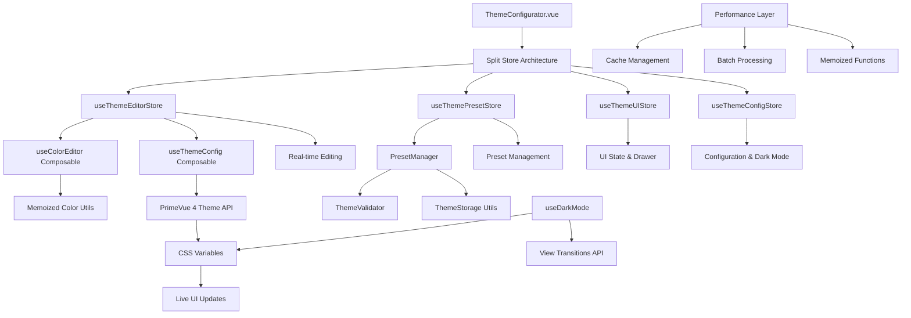
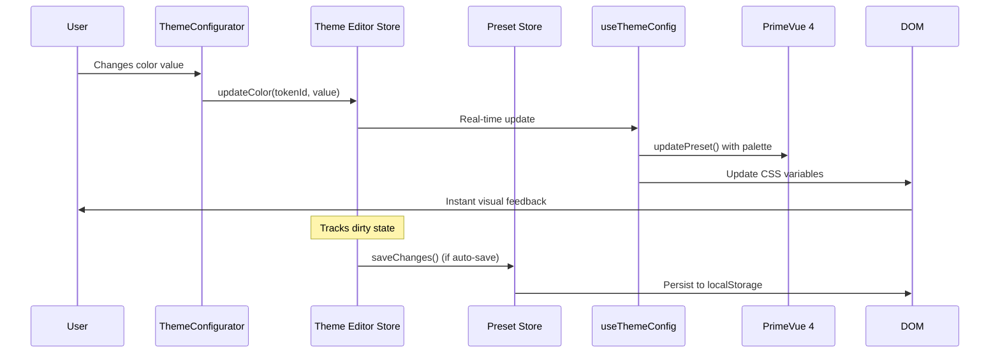
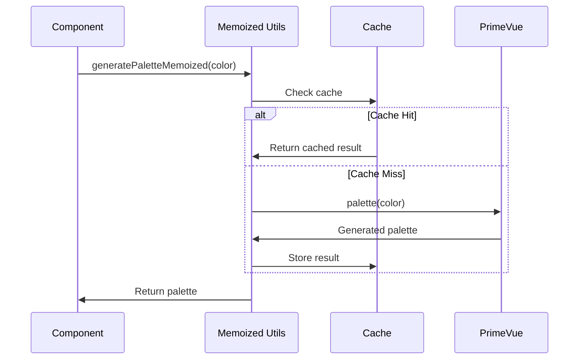

# 🎨 Triton Theme Configuration System - Technical Documentation

## Table of Contents
1. [Overview](#overview)
2. [Architecture](#architecture)
3. [File Structure](#file-structure)
4. [Store Architecture](#store-architecture)
5. [Core Components](#core-components)
6. [Composables](#composables)
7. [Data Flow](#data-flow)
8. [API Reference](#api-reference)
9. [User Guide](#user-guide)
10. [Developer Guide](#developer-guide)
11. [Performance Optimizations](#performance-optimizations)
12. [Troubleshooting](#troubleshooting)

---

## Overview

The Triton Theme Configuration System is a comprehensive, real-time theme customization solution built for Vue 3 applications using PrimeVue 4. The system has evolved into a modular, high-performance architecture with split stores for better separation of concerns and enhanced user experience.

### Key Features
- **🏗️ Split Store Architecture** with dedicated stores for config, UI, presets, and editing
- **⚡ Real-time theme editing** with instant visual feedback and performance optimizations
- **🎨 Advanced color editing** with multiple format support, palettes, and color harmonies
- **📚 Built-in preset library** with professional themes (Default, High Contrast, Ocean, Sunset, Corporate)
- **💾 Enhanced preset management** with CRUD operations, import/export, and validation
- **🌙 Advanced dark mode** with smooth transitions using View Transitions API
- **♿ Accessibility support** with WCAG compliance and high contrast themes
- **🔄 Cross-tab synchronization** for consistent experience
- **🚀 Performance optimizations** with memoized color calculations
- **📱 Modern UI** with PrimeVue 4 components and responsive design

### Technical Stack
- **Vue 3** with Composition API and `<script setup>`
- **Pinia** for state management (split stores)
- **PrimeVue 4** (Styled Mode) with latest design tokens API
- **TypeScript** for comprehensive type safety
- **LocalStorage** with intelligent caching and quota management
- **CSS Variables** for real-time theme updates
- **View Transitions API** for smooth dark mode transitions

---

## Architecture

### System Architecture Diagram



### Core Principles

1. **Modular Architecture**: Split stores for single responsibility
2. **Performance First**: Memoized calculations and optimized rendering
3. **Type Safety**: Comprehensive TypeScript coverage with strict types
4. **User Experience**: Smooth transitions and intuitive interface
5. **Accessibility**: WCAG compliance and high contrast support
6. **Extensibility**: Plugin-ready architecture for easy enhancement

---

## File Structure

```
src/
├── components/theme/
│   ├── ThemeConfigurator.vue         # Main configurator with drawer UI
│   ├── ColorTokenEditor.vue          # Advanced color editor with palettes
│   ├── PresetManager.vue             # Complete preset CRUD interface
│   ├── PresetGrid.vue               # Visual preset gallery
│   ├── ThemePreview.vue             # Live theme preview
│   └── ThemeExporter.vue            # Import/export functionality
├── stores/theme/
│   ├── config.store.ts              # Configuration & dark mode
│   ├── ui.store.ts                  # UI state management
│   ├── preset.store.ts              # Preset CRUD operations
│   ├── editor.store.ts              # Real-time editing
│   └── index.ts                     # Unified exports
├── themes/
│   ├── presets/
│   │   ├── preset.types.ts          # TypeScript definitions
│   │   └── preset-manager.ts        # Preset management logic
│   ├── config/
│   │   └── theme.config.ts          # Token definitions & categories
│   ├── composables/
│   │   ├── useThemeConfig.ts        # PrimeVue integration
│   │   └── useColorEditor.ts        # Color manipulation
│   ├── utils/
│   │   ├── storage.ts               # ThemeStorage class
│   │   ├── validation.ts            # ThemeValidator class
│   │   └── color-utils.ts           # Color calculations
│   ├── custom-preset.ts             # Default Triton theme
│   └── token-factory.ts             # Token utilities
├── utils/performance/
│   └── color-utils-optimized.ts     # Memoized color functions
├── composables/
│   └── useDarkMode.ts               # Enhanced dark mode
└── main.ts                          # Theme system initialization
```

---

## Store Architecture

### Split Store Pattern

The theme system uses a split store architecture for better separation of concerns:

#### 1. useThemeConfigStore
**Manages global configuration and dark mode**

```typescript
interface ThemeConfig {
  activePresetId: string
  baseTheme: BaseTheme
  darkMode: boolean
  autoSave: boolean
  syncAcrossTabs: boolean
  smoothTransitions: boolean
  storageKey: string
  maxSavedPresets?: number
}
```

**Key Features:**
- Dark mode with CSS class management
- Cross-tab synchronization via storage events
- Auto-save configuration
- Base theme switching

#### 2. useThemeUIStore
**Manages UI state for the configurator**

```typescript
interface ThemeUIState {
  configSidebarVisible: boolean
  isDirty: boolean
  isLoading: boolean
  activeTab: 'presets' | 'colors' | 'settings'
  expandedSections: Set<string>
}
```

**Key Features:**
- Drawer/sidebar visibility
- Dirty state tracking
- Loading states
- Section expansion state

#### 3. useThemePresetStore
**Handles all preset operations**

```typescript
// Built-in presets: Triton Default, High Contrast, Ocean, Sunset, Corporate
// User presets: Custom themes with full CRUD operations
// Smart caching and validation
```

**Key Features:**
- Built-in preset library (5 professional themes)
- User preset CRUD operations
- Import/export with validation
- Preset duplication and metadata management

#### 4. useThemeEditorStore
**Real-time theme editing functionality**

```typescript
interface EditorState {
  editingPreset: ThemePreset | null
  editingColors: ColorOverride[]
  originalColors: ColorOverride[]
  hasChanges: boolean
  canSave: boolean
}
```

**Key Features:**
- Real-time color editing with instant preview
- Undo/redo capabilities
- Palette generation for brand colors
- Change tracking and dirty state

---

## Core Components

### 1. ThemeConfigurator.vue
**Main orchestration component with modern drawer UI**

**Key Features:**
- 420px responsive drawer interface
- Live preset switching with visual previews
- Tabbed color token editor (Brand, Status, Surface, Text, Interaction)
- Color harmony tools (Monochromatic, Complementary, Triadic, Analogous)
- Advanced preferences panel
- Storage information display

**Enhanced Props:** None (uses global stores)

**Events:** Fully reactive through stores

**New Methods:**
```typescript
async updateTokenColor(tokenId: string, value: string) // Real-time updates
async applyColorHarmony(type: HarmonyType) // Color scheme generation
async saveCurrentPreset() // Intelligent saving
async resetToDefaults() // Smart reset
```

### 2. ColorTokenEditor.vue
**Advanced color editing with multi-format support**

**Enhanced Features:**
- Visual color swatch with live preview
- Multi-format editing (Hex, RGB, HSL) with real-time conversion
- 24-color quick preset palette
- Color variations (lighter/darker/saturated)
- Clipboard integration
- Palette-based editing for brand colors
- Real-time validation with error display

**Props:**
```typescript
interface Props {
  token: ColorToken
  value: string
  isEdited?: boolean
}
```

**Events:**
```typescript
interface Emits {
  update: [tokenId: string, value: string]
  reset: [tokenId: string]
  edit: [tokenId: string]
}
```

### 3. PresetManager.vue
**Comprehensive preset management interface**

**Enhanced Features:**
- Modal dialog interface (800px responsive)
- Tabbed preset organization (All/Built-in/Custom)
- Advanced CRUD operations with validation
- Bulk import/export functionality
- Storage quota monitoring
- Preset metadata editing (tags, descriptions)
- Visual preset previews with color swatches

### 4. PresetGrid.vue
**Visual preset gallery with enhanced UX**

**New Features:**
- Responsive grid layout (1-3 columns based on screen size)
- Rich preset cards with metadata display
- Context menus for quick actions
- Color preview strips showing main colors
- Status indicators (active, default, built-in)
- Empty state with call-to-action

---

## Composables

### 1. useThemeConfig
**Enhanced PrimeVue integration composable**

**New Capabilities:**
```typescript
interface ThemeConfigReturn {
  // Enhanced token organization
  tokensByCategory: ComputedRef<Record<string, ColorToken[]>>
  
  // Advanced theme operations
  updateTokenColor(tokenId: string, value: string): Promise<void>
  switchBaseTheme(baseTheme: BaseTheme): Promise<void>
  resetToPresetDefaults(): Promise<void>
  
  // Color harmony generation
  generateColorHarmony(baseColor: string, type: HarmonyType): ColorHarmonyResult
  applyColorHarmony(harmony: ColorHarmonyResult): Promise<void>
  
  // Real-time integration
  applyColorUpdate(tokenId: string, value: string): Promise<void>
  updateCSSProperty(tokenId: string, value: string): void
  getCurrentCSSValue(cssVariable: string): string
  
  // Accessibility
  checkColorContrast(foreground: string, background: string): ContrastResult
}
```

**PrimeVue 4 Integration:**
- Direct integration with `updatePreset()` API
- Automatic palette generation using `palette()` function
- Support for semantic color tokens
- Real-time CSS variable updates

### 2. useColorEditor
**Advanced color manipulation composable**

**Enhanced Features:**
```typescript
interface ColorEditorReturn {
  // State management
  currentTokenId: Ref<string | null>
  currentValue: Ref<string>
  isEditing: Ref<boolean>
  previewMode: Ref<boolean>
  
  // Color format conversion
  colorFormats: ComputedRef<{
    hex: string
    rgb: string
    hsl: string
    hsv: string
  }>
  
  // Advanced editing
  startEditing(tokenId: string, initialValue?: string): void
  updateColor(newValue: string, applyImmediately?: boolean): boolean
  applyToTheme(): Promise<void>
  togglePreview(): void
  
  // Color tools
  generateVariations(): ColorVariations
  selectFromPalette(shade: number): void
  applyQuickPreset(presetName: string): void
  
  // Clipboard operations
  copyToClipboard(format: 'hex' | 'rgb' | 'hsl'): Promise<boolean>
  pasteFromClipboard(): Promise<boolean>
}
```

### 3. useDarkMode
**Enhanced dark mode with smooth transitions**

**New Features:**
```typescript
interface DarkModeReturn {
  // Enhanced state
  isDark: ComputedRef<boolean>
  isTransitioning: Ref<boolean>
  systemPrefersDark: Ref<boolean>
  supportsViewTransitions: Ref<boolean>
  
  // Smooth transitions
  toggle(): Promise<void>
  setDarkMode(dark: boolean, skipTransition?: boolean): Promise<void>
  
  // System integration
  setFollowSystemPreference(follow: boolean): void
  getTimeBaedSuggestion(): boolean
  scheduleAutoDarkMode(enable: boolean): void
  
  // Accessibility
  getContrastPreference(): 'high' | 'normal' | 'low'
  applyContrastPreference(): void
  updateThemeColorMeta(dark: boolean): void
}
```

**View Transitions Integration:**
- Smooth transitions using `document.startViewTransition()`
- Fallback for browsers without support
- Configurable transition preferences

---

## Data Flow

### Enhanced Theme Change Flow



### Performance-Optimized Color Processing



---

## API Reference

### Split Store APIs

#### ThemeConfigStore
```typescript
interface ThemeConfigStore {
  // State
  config: Ref<ThemeConfig>
  
  // Getters
  isDarkMode(): boolean
  isAutoSave(): boolean
  isSyncEnabled(): boolean
  
  // Actions
  initialize(): Promise<void>
  toggleDarkMode(): void
  setDarkMode(isDark: boolean): void
  setActivePresetId(presetId: string): void
  setBaseTheme(theme: BaseTheme): void
  loadSavedConfig(): void
  saveConfig(): void
  resetConfig(): void
}
```

#### ThemeUIStore
```typescript
interface ThemeUIStore {
  // State
  configSidebarVisible: Ref<boolean>
  isDirty: Ref<boolean>
  isLoading: Ref<boolean>
  activeTab: Ref<'presets' | 'colors' | 'settings'>
  expandedSections: Ref<Set<string>>
  
  // Actions
  toggleConfig(): void
  setConfigVisible(visible: boolean): void
  setDirty(dirty: boolean): void
  setLoading(loading: boolean): void
  setActiveTab(tab: string): void
  toggleSection(sectionId: string): void
  resetUI(): void
}
```

#### ThemePresetStore
```typescript
interface ThemePresetStore {
  // State
  presets: Ref<ThemePreset[]>
  activePreset: Ref<ThemePreset | null>
  
  // Computed
  availablePresets: ComputedRef<ThemePreset[]>
  userPresets: ComputedRef<ThemePreset[]>
  builtInPresets: ComputedRef<ThemePreset[]>
  
  // Actions
  initialize(): Promise<void>
  activatePreset(preset: ThemePreset): Promise<void>
  createPreset(name: string, description?: string): Promise<ThemePreset>
  updatePreset(preset: ThemePreset): Promise<void>
  deletePreset(presetId: string): Promise<void>
  duplicatePreset(presetId: string, newName: string): Promise<ThemePreset>
  exportPreset(presetId: string): Promise<void>
  importPreset(file: File): Promise<ThemePreset>
  searchPresets(query: string): ThemePreset[]
}
```

#### ThemeEditorStore
```typescript
interface ThemeEditorStore {
  // State
  editingPreset: Ref<ThemePreset | null>
  editingColors: Ref<ColorOverride[]>
  
  // Computed
  hasChanges: ComputedRef<boolean>
  canSave: ComputedRef<boolean>
  isEditingBuiltIn: ComputedRef<boolean>
  
  // Actions
  startEditing(preset: ThemePreset): void
  stopEditing(): void
  updateColor(tokenId: string, value: string): Promise<void>
  removeColorOverride(tokenId: string): Promise<void>
  resetColor(tokenId: string): void
  resetAllColors(): void
  getTokenValue(tokenId: string): string
  hasOverride(tokenId: string): boolean
  applyColors(): Promise<void>
  saveChanges(): Promise<void>
  saveAsNewPreset(name: string, description?: string): Promise<ThemePreset>
}
```

### Enhanced Utility Classes

#### ThemeStorage
```typescript
class ThemeStorage {
  static save<T>(key: string, data: T, options?: StorageOptions): boolean
  static load<T>(key: string, options?: StorageOptions): T | null
  static remove(key: string): boolean
  static exists(key: string): boolean
  static getUsageStats(): StorageStats
  static clearThemeData(): boolean
  static backupData(keys?: string[]): string
  static restoreData(backupData: string): boolean
}
```

#### ThemeValidator
```typescript
class ThemeValidator {
  static validatePreset(preset: unknown): ValidationResult
  static validateColorOverride(override: unknown): ValidationResult
  static validateColor(color: string): ValidationResult
  static validateMetadata(metadata: unknown): ValidationResult
  static validateConfig(config: unknown): ValidationResult
  static checkContrast(foreground: string, background: string): ValidationResult
  static validateImportFile(file: File): ValidationResult
  static getValidationSummary(results: ValidationResult[]): ValidationSummary
}
```

#### PresetManager
```typescript
class PresetManager {
  async loadBuiltInPresets(): Promise<ThemePreset[]>
  async loadUserPresets(): Promise<ThemePreset[]>
  async saveUserPreset(preset: ThemePreset): Promise<void>
  async deleteUserPreset(presetId: string): Promise<void>
  async exportPreset(preset: ThemePreset): Promise<Blob>
  async importPreset(file: File): Promise<ThemePreset>
  async duplicatePreset(preset: ThemePreset, newName: string): Promise<ThemePreset>
  getStorageStats(): StorageStats
  async clearAllUserPresets(): Promise<void>
}
```

### Performance Utilities

#### Memoized Color Functions
```typescript
export const memoizedColorUtils = {
  parseColor: parseColorMemoized,
  getRelativeLuminance: getRelativeLuminanceMemoized,
  getContrastRatio: getContrastRatioMemoized,
  checkContrast: checkContrastMemoized,
  generateColorScale: generateColorScaleMemoized,
  getBestTextColor: getBestTextColorMemoized,
  generateColorHarmonies: generateColorHarmoniesMemoized,
  generatePalette: generatePaletteMemoized
}
```

---

## User Guide

### Getting Started

1. **Access Theme Configurator**
   - Click the palette icon (🎨) in the application header
   - The theme configurator drawer opens on the right (420px width)

2. **Choose a Built-in Theme**
   - Use the "Active Theme" dropdown to select from 5 professional presets:
     - **Triton Default**: Navy and blue professional theme
     - **High Contrast**: WCAG AAA compliant accessibility theme
     - **Ocean**: Light teal and blue oceanic theme
     - **Sunset**: Warm orange and red sunset theme
     - **Corporate**: Professional gray and blue business theme

3. **Customize Colors**
   - Navigate through color token tabs: Brand, Status, Surface, Text, Interaction
   - Click any color swatch to open the advanced color editor
   - Use Hex, RGB, or HSL formats with real-time conversion
   - Select from 24 quick color presets or generate color variations

### Advanced Features

#### Creating Custom Themes
1. Click "Manage" → "Create New" in the preset manager
2. Name your theme and add a description
3. Customize colors using the tabbed color editor
4. Add tags for organization
5. Save your custom theme

#### Using Color Harmonies
1. Select a primary color in the Brand Colors tab
2. Click one of the harmony buttons:
   - **Monochromatic**: Different shades of the same color
   - **Complementary**: Opposite colors on the color wheel
   - **Triadic**: Three equally spaced colors
   - **Analogous**: Adjacent colors on the color wheel
3. Review and fine-tune the generated colors

#### Dark Mode
- Toggle dark mode using the mode switch in the configurator
- Smooth transitions with View Transitions API (when supported)
- Automatic system preference following
- Time-based suggestions (evening = dark, morning = light)

#### Import/Export Themes
1. **Export**: In Preset Manager, use context menu on any preset
2. **Import**: Use the Import/Export accordion in the configurator
3. Themes are JSON files that can be shared between installations
4. Automatic validation ensures imported themes are compatible

### Configuration Preferences

Access in the "Preferences" accordion:
- **Auto-save changes**: Automatically save modifications as you make them
- **Sync across tabs**: Keep theme settings synchronized across browser tabs
- **Smooth transitions**: Enable smooth animations for theme and dark mode changes

---

## Developer Guide

### Setting Up Development Environment

1. **Install Dependencies**
   ```bash
   npm install
   ```

2. **Development Server with Theme System**
   ```bash
   npm run dev
   ```

3. **Type Checking**
   ```bash
   npm run type-check
   ```

### Adding New Color Tokens

1. **Define the Token** in `src/themes/config/theme.config.ts`:
   ```typescript
   {
     id: 'custom-accent',
     label: 'Custom Accent',
     category: 'brand',
     description: 'Custom accent color for special elements',
     cssVariable: '--p-custom-accent',
     defaultValue: '#FF6B35'
   }
   ```

2. **Use in Components**:
   ```css
   .my-component {
     background-color: var(--p-custom-accent);
   }
   ```

### Creating Custom Presets

1. **Add to PresetManager** in `src/themes/presets/preset-manager.ts`:
   ```typescript
   const customPreset: ThemePreset = {
     id: 'my-custom-theme',
     name: 'My Custom Theme',
     description: 'A beautiful custom theme',
     baseTheme: 'Material',
     colorOverrides: [
       {
         tokenId: 'primary',
         value: '#1E3A8A',
         palette: palette('#1E3A8A')
       }
       // ... more overrides
     ],
     metadata: {
       created: new Date().toISOString(),
       modified: new Date().toISOString(),
       author: 'Your Name',
       version: '1.0.0',
       tags: ['custom', 'blue'],
       isBuiltIn: true,
       isDefault: false
     }
   }
   ```

2. **Register in loadBuiltInPresets()** method

### Extending Color Utilities

Add custom functions to `src/themes/utils/color-utils.ts`:

```typescript
export function customColorTransform(color: string, factor: number): string {
  const rgb = parseColor(color)
  if (!rgb) return color
  
  const transformed = {
    r: Math.min(255, rgb.r * factor),
    g: Math.min(255, rgb.g * factor),
    b: Math.min(255, rgb.b * factor)
  }
  
  return rgbToHex(transformed.r, transformed.g, transformed.b)
}
```

### Performance Considerations

1. **Memoized Functions**: Color calculations are automatically memoized
2. **Batch Updates**: Use batch operations when updating multiple colors
3. **Smart Caching**: Built-in cache management with LRU eviction
4. **Debounced Updates**: Real-time updates are debounced to prevent excessive renders

### Testing Guidelines

1. **Unit Tests**: Test utility functions
   ```typescript
   describe('Color Utils', () => {
     test('parseColor should handle hex colors', () => {
       expect(parseColor('#FF0000')).toEqual({ r: 255, g: 0, b: 0 })
     })
   })
   ```

2. **Component Tests**: Test component behavior with stores
   ```typescript
   describe('ColorTokenEditor', () => {
     test('should emit update event when color changes', async () => {
       // Test component with store integration
     })
   })
   ```

---

## Performance Optimizations

### Memoization Strategy

The system uses comprehensive memoization for expensive operations:

1. **Color Parsing**: `parseColorMemoized()` caches parsed color objects
2. **Contrast Calculations**: `getContrastRatioMemoized()` caches WCAG calculations
3. **Palette Generation**: `generatePaletteMemoized()` caches PrimeVue palettes
4. **Color Harmonies**: `generateColorHarmoniesMemoized()` caches harmony calculations

### Cache Management

```typescript
// Automatic LRU cache with configurable size
const CACHE_SIZE = 500 // Configurable per function

// Built-in cache clearing for memory management
clearColorCaches() // Clear all memoization caches
```

### Real-time Updates

- **Debounced Updates**: Color changes are debounced to prevent excessive re-renders
- **CSS Variable Updates**: Direct CSS variable manipulation for instant feedback
- **Batch Processing**: Multiple color updates are processed efficiently

### Storage Optimization

- **Intelligent Caching**: Only changed values are stored, not entire theme definitions
- **Quota Management**: Automatic storage quota monitoring and cleanup
- **Compression**: Optional compression for large theme data

---

## Troubleshooting

### Common Issues

#### 1. Theme Not Applying
**Symptoms**: Color changes don't appear in the UI

**Causes & Solutions**:
```typescript
// Check if stores are initialized
const presetStore = useThemePresetStore()
await presetStore.initialize()

// Verify PrimeVue integration
const themeConfig = useThemeConfig()
await themeConfig.applyColorUpdate(tokenId, value)

// Check CSS variables
const value = document.documentElement.style.getPropertyValue('--p-primary')
console.log('CSS Variable Value:', value)
```

#### 2. Split Store Issues
**Symptoms**: Store methods not available

**Solution**:
```typescript
// Use individual stores instead of legacy unified store
import { useThemeConfigStore, useThemePresetStore } from '@/stores/theme'

// NOT: useThemeStore() (legacy)
const configStore = useThemeConfigStore()
const presetStore = useThemePresetStore()
```

#### 3. Performance Issues
**Symptoms**: Slow color updates or theme switching

**Solutions**:
```typescript
// Use memoized functions for expensive operations
import { memoizedColorUtils } from '@/utils/performance/color-utils-optimized'

// Batch multiple updates
const editorStore = useThemeEditorStore()
editorStore.startEditing(preset)
await editorStore.updateColor('primary', '#123456')
await editorStore.updateColor('secondary', '#654321')
await editorStore.saveChanges()
```

#### 4. Storage Quota Exceeded
**Symptoms**: "Storage quota exceeded" error

**Solutions**:
```typescript
// Check storage usage
const stats = ThemeStorage.getUsageStats()
console.log(`Storage: ${stats.totalSizeKB}KB used`)

// Clear theme data
ThemeStorage.clearThemeData()

// Or clear specific presets
const presetStore = useThemePresetStore()
await presetStore.deletePreset(unusedPresetId)
```

### Debug Mode

Enable debug logging:

```typescript
// In theme stores, debug mode is automatically enabled in development
const DEBUG = import.meta.env.DEV

if (DEBUG) {
  console.log('🎨 Theme debug mode enabled')
  
  // All store actions are logged with prefixes:
  // 🎨 Config actions
  // 👤 Preset actions
  // ✏️ Editor actions
  // 🖥️ UI actions
}
```

### Performance Monitoring

Monitor theme system performance:

```typescript
// Built-in performance logging
console.log('Theme change took Xms') // Automatic logging

// Cache statistics
const stats = getColorCacheStats()
console.log('Cache performance:', stats)

// Storage monitoring
const storage = ThemeStorage.getUsageStats()
console.log('Storage usage:', storage)
```

---

## Migration Guide

### From Legacy Theme Store

If migrating from the old monolithic theme store:

```typescript
// OLD (deprecated)
import { useThemeStore } from '@/stores/theme.store'
const themeStore = useThemeStore()

// NEW (current)
import { 
  useThemeConfigStore,
  useThemeUIStore, 
  useThemePresetStore,
  useThemeEditorStore 
} from '@/stores/theme'

const configStore = useThemeConfigStore()
const uiStore = useThemeUIStore() 
const presetStore = useThemePresetStore()
const editorStore = useThemeEditorStore()
```

### Store Method Mapping

```typescript
// Legacy → New Store Mapping
themeStore.toggleConfig() → uiStore.toggleConfig()
themeStore.activatePreset() → presetStore.activatePreset()
themeStore.updateColor() → editorStore.updateColor()
themeStore.toggleDarkMode() → configStore.toggleDarkMode()
```

---

## Conclusion

The Triton Theme Configuration System provides a modern, performant, and extensible foundation for theme customization in Vue 3 applications. Its split store architecture, enhanced components, and performance optimizations make it suitable for both end-users and developers building sophisticated theming solutions.

The system's modular design allows for easy extension and customization while maintaining type safety and performance. With comprehensive built-in presets, advanced color tools, and accessibility features, it provides a complete theming solution for modern web applications.

**Version**: 2.0.0  
**Last Updated**: January 2024  
**Maintainers**: Triton Development Team

### Recent Major Updates (v2.0.0)

- ✅ **Split Store Architecture**: Migrated from monolithic to modular stores
- ✅ **Enhanced Performance**: Added memoization and optimized color calculations  
- ✅ **Built-in Preset Library**: 5 professional themes included
- ✅ **Advanced Color Editor**: Multi-format editing with palettes and harmonies
- ✅ **Modern UI**: Complete redesign with PrimeVue 4 components
- ✅ **Accessibility**: WCAG compliance and high contrast support
- ✅ **Developer Experience**: Comprehensive TypeScript coverage and debugging tools 