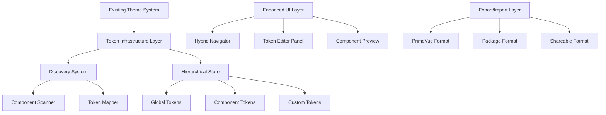

# 🎨 Triton Advanced Theme Configuration System - Implementation Plan

## 📋 Executive Summary

This document outlines the comprehensive plan to upgrade the existing Triton theme system into an advanced configuration platform with enterprise-grade features. The upgrade maintains backward compatibility while adding token discovery, component-specific editing, live preview, and advanced export capabilities.

### Key Enhancements
- **Hierarchical Token System**: Primitive → Semantic → Component → Custom tokens
- **Automatic Token Discovery**: Scan and map all PrimeVue component tokens
- **Hybrid Navigation**: Switch between token-based and component-based editing
- **Live Component Preview**: Real-time updates with token highlighting
- **Advanced Export**: Generate PrimeVue-compatible theme packages
- **Performance Optimizations**: Batched updates, caching, and lazy loading

## 🏗️ Architecture Overview



## 📅 Implementation Timeline

| Phase | Duration | Dependencies | Priority | Status |
|-------|----------|--------------|----------|---------|
| Phase 1: Token Infrastructure | 1 week | None | High | Pending |
| Phase 2: Token Discovery | 1 week | Phase 1 | High | Pending |
| Phase 3: Enhanced UI | 2 weeks | Phase 1, 2 | High | Pending |
| Phase 4: Component Preview | 1 week | Phase 3 | Medium | Pending |
| Phase 5: Advanced Editor | 1 week | Phase 3 | Medium | Pending |
| Phase 6: Export/Import | 1 week | Phase 1-5 | Medium | Pending |
| Phase 7: Performance | 1 week | Phase 1-6 | Low | Pending |
| Phase 8: Testing & Docs | 1 week | All phases | Low | Pending |

**Total Duration**: 6-8 weeks

## 🚀 Implementation Phases

### Phase 1: Token Infrastructure Enhancement (Week 1)

#### Objectives
- Extend existing token types with hierarchical structure
- Create token registry for centralized management
- Add validation and relationship tracking

#### Tasks

##### 1.1 Extend Token Type System
**File:** `src/themes/presets/preset.types.ts`

Add new interfaces to support hierarchical token structure:
- `DesignToken` interface with categories (primitive, semantic, component, custom)
- `TokenValidation` for input validation
- `TokenRelationship` for dependency tracking
- Extended `ThemePreset` with new token structure

##### 1.2 Create Token Registry
**File:** `src/themes/core/token-registry.ts`

Implement centralized token management:
- Singleton pattern for global access
- Token registration and retrieval
- Category-based filtering
- Relationship mapping

#### Deliverables
- [ ] Extended type definitions
- [ ] Token registry implementation
- [ ] Migration script for existing tokens
- [ ] Unit tests for registry

---

### Phase 2: Token Discovery System (Week 1-2)

#### Objectives
- Build automatic discovery of PrimeVue component tokens
- Map existing theme structure to new token system
- Create token categorization logic

#### Tasks

##### 2.1 Create Token Discovery Engine
**File:** `src/themes/core/token-discovery.ts`

Implement token discovery features:
- Component list (70+ PrimeVue components)
- Recursive token extraction from theme objects
- Token type inference based on naming patterns
- Metadata generation for discovered tokens

##### 2.2 Implement Discovery Cache
- Cache discovered tokens for performance
- Refresh mechanism for development mode
- Persistence options for production

#### Deliverables
- [ ] Token discovery class
- [ ] Component token mapping
- [ ] Discovery cache system
- [ ] Discovery tests

---

### Phase 3: Enhanced UI Components (Week 2-3)

#### Objectives
- Upgrade ThemeConfigurator with hybrid navigation
- Implement responsive layout modes
- Add advanced search and filtering

#### Tasks

##### 3.1 Create Advanced Theme Configurator
**File:** `src/components/theme/ThemeConfiguratorAdvanced.vue`

Features to implement:
- Drawer with adjustable width based on view mode
- Sidebar navigation with tabs (Tokens, Components, Presets)
- Search functionality with autocomplete
- View mode toggle (sidebar, split, preview)
- Empty state with quick actions

##### 3.2 Build Navigation Components
- `TokenNavigationTree.vue` - Hierarchical token browser
- `ComponentNavigationTree.vue` - Component list with badges
- `PresetNavigationList.vue` - Preset management interface

##### 3.3 Implement State Management
Update store structure:
- Enhanced UI store for navigation state
- Token discovery results storage
- View preferences persistence

#### Deliverables
- [ ] Advanced configurator component
- [ ] Navigation components
- [ ] Updated store modules
- [ ] UI component tests

---

### Phase 4: Component Preview System (Week 3)

#### Objectives
- Create live component preview with state simulation
- Implement token highlighting on hover
- Build component showcase templates

#### Tasks

##### 4.1 Create Component Preview Engine
**File:** `src/components/theme/ComponentPreview.vue`

Core features:
- Dynamic component loading
- State simulation (hover, focus, active, disabled)
- Dark mode toggle
- Token info overlay
- Component variations (states, sizes, themes)

##### 4.2 Build Component Showcases
Create showcase components for key components:
- `ButtonShowcase.vue` - All button variants and states
- `DataTableShowcase.vue` - Table with sample data
- `DialogShowcase.vue` - Modal variations
- `InputShowcase.vue` - Form input states
- Additional showcases as needed

##### 4.3 Implement Token Highlighting
- Token detection on component hover
- Visual highlighting system
- Click-to-edit functionality

#### Deliverables
- [ ] Component preview system
- [ ] 10+ component showcases
- [ ] Token highlighting logic
- [ ] Preview tests

---

### Phase 5: Advanced Token Editor (Week 4)

#### Objectives
- Build dynamic token editor with type-specific inputs
- Implement change history tracking
- Add bulk operations support

#### Tasks

##### 5.1 Create Token Editor Panel
**File:** `src/components/theme/TokenEditorPanel.vue`

Features:
- Search and filter toolbar
- Grouped token display
- Expand/collapse functionality
- Change history sidebar
- Batch operations

##### 5.2 Build Type-Specific Inputs
Create specialized input components:
- `ColorTokenInput.vue` - Advanced color picker
- `SizeTokenInput.vue` - Size units with conversion
- `SpacingTokenInput.vue` - Spacing scale editor
- `BorderRadiusInput.vue` - Radius previews
- `ShadowTokenInput.vue` - Shadow builder
- `TypographyTokenInput.vue` - Font settings

##### 5.3 Implement Change Tracking
- History storage with timestamps
- Undo/redo functionality
- Change comparison view
- Revert capabilities

#### Deliverables
- [ ] Token editor panel
- [ ] Specialized input components
- [ ] Change history system
- [ ] Editor tests

---

### Phase 6: Export/Import System (Week 4-5)

#### Objectives
- Build comprehensive theme export system
- Support multiple export formats
- Implement theme import with validation

#### Tasks

##### 6.1 Create Theme Exporter
**File:** `src/themes/core/theme-exporter.ts`

Export formats:
- **PrimeVue Format**: Component-based file structure
- **Package Format**: NPM-installable package
- **Shareable Format**: Single JSON file

##### 6.2 Implement Export Features
- File structure generation
- Token tree building
- Package.json generation
- README documentation
- TypeScript definitions

##### 6.3 Build Import System
- File validation
- Token mapping
- Conflict resolution
- Preview before import

#### Deliverables
- [ ] Export system implementation
- [ ] Import functionality
- [ ] Format converters
- [ ] Export/import tests

---

### Phase 7: Performance Optimizations (Week 5)

#### Objectives
- Implement efficient update batching
- Add caching and memoization
- Optimize rendering performance

#### Tasks

##### 7.1 Create Performance Manager
**File:** `src/themes/core/performance-manager.ts`

Features:
- Update queue with priority levels
- Batch CSS variable updates
- RequestAnimationFrame optimization
- Debounced/throttled operations

##### 7.2 Implement Caching System
- Token value cache
- Discovery results cache
- Computed values memoization
- LRU cache implementation

##### 7.3 Add Lazy Loading
- Component preview lazy loading
- Intersection observer integration
- Virtual scrolling for long lists

#### Deliverables
- [ ] Performance manager
- [ ] Caching implementation
- [ ] Lazy loading system
- [ ] Performance benchmarks

---

### Phase 8: Testing & Documentation (Week 5-6)

#### Objectives
- Create comprehensive test suite
- Write user and developer documentation
- Build example themes

#### Tasks

##### 8.1 Write Test Suite
Test categories:
- Unit tests for core functions
- Integration tests for token flow
- Component tests for UI elements
- E2E tests for workflows

##### 8.2 Create Documentation
- User guide with screenshots
- Developer API reference
- Migration guide from old system
- Troubleshooting guide

##### 8.3 Build Example Themes
- High contrast theme
- Brand-specific themes
- Component-focused themes

#### Deliverables
- [ ] Test suite (80%+ coverage)
- [ ] User documentation
- [ ] Developer documentation
- [ ] Example themes

---

## 📁 File Structure

```
src/
├── components/
│   └── theme/
│       ├── ThemeConfiguratorAdvanced.vue    # Main UI
│       ├── TokenEditorPanel.vue             # Token editor
│       ├── ComponentPreview.vue             # Preview system
│       ├── TokenNavigationTree.vue          # Token browser
│       ├── ComponentNavigationTree.vue      # Component browser
│       ├── inputs/                          # Specialized inputs
│       │   ├── ColorTokenInput.vue
│       │   ├── SizeTokenInput.vue
│       │   └── ...
│       └── showcases/                       # Component showcases
│           ├── ButtonShowcase.vue
│           ├── DataTableShowcase.vue
│           └── ...
├── themes/
│   ├── core/
│   │   ├── token-registry.ts               # Token management
│   │   ├── token-discovery.ts              # Discovery system
│   │   ├── theme-exporter.ts               # Export functionality
│   │   └── performance-manager.ts          # Performance utilities
│   ├── composables/
│   │   ├── useThemeStudio.ts              # Main composable
│   │   ├── useComponentTokens.ts           # Component tokens
│   │   └── useTokenEditor.ts              # Editor logic
│   └── __tests__/                         # Test files
└── stores/
    └── theme/
        ├── advanced.store.ts               # New advanced features
        └── discovery.store.ts              # Discovery results
```

## 🔧 Technical Considerations

### Browser Support
- Modern browsers with CSS Custom Properties support
- Chrome 80+, Firefox 75+, Safari 13.1+, Edge 80+

### Performance Targets
- Token update: < 16ms (60fps)
- Batch update: < 100ms for 50 tokens
- Discovery: < 2s for all components
- Export: < 5s for complete theme

### Dependencies
- Existing: Vue 3, Pinia, PrimeVue 4
- New: JSZip (export), file-saver (download)
- Dev: Vitest (testing), @vue/test-utils

## 🚦 Success Criteria

### Phase Completion
- [ ] All deliverables completed
- [ ] Tests passing (>80% coverage)
- [ ] Performance targets met
- [ ] Documentation complete

### Overall Project
- [ ] Backward compatibility maintained
- [ ] All PrimeVue components supported
- [ ] Export formats validated
- [ ] User acceptance testing passed

## 🎯 Risk Management

### Technical Risks
1. **PrimeVue API Changes**
   - Mitigation: Version lock, compatibility layer
   
2. **Performance Degradation**
   - Mitigation: Continuous benchmarking, optimization

3. **Browser Compatibility**
   - Mitigation: Polyfills, progressive enhancement

### Project Risks
1. **Scope Creep**
   - Mitigation: Strict phase boundaries, change control

2. **Timeline Delays**
   - Mitigation: Buffer time, parallel development

## 📊 Metrics & Monitoring

### Development Metrics
- Code coverage: Target 80%+
- Bundle size increase: Max 50KB
- Performance regression: Max 10%

### User Metrics
- Theme creation time: 50% reduction
- Export success rate: 95%+
- User satisfaction: 4.5+ stars

## 🔄 Migration Strategy

### For Existing Users
1. Parallel operation of old and new systems
2. Automatic migration of existing themes
3. Gradual feature rollout with flags
4. Comprehensive migration guide

### Data Migration
1. Export existing presets
2. Transform to new format
3. Validate migrated data
4. Import to new system

## 📚 Resources

### Documentation
- [Vue 3 Composition API](https://vuejs.org/guide/extras/composition-api-faq.html)
- [PrimeVue 4 Theming](https://primevue.org/theming)
- [Design Tokens Spec](https://design-tokens.github.io/community-group/format/)

### Tools
- [Vite](https://vitejs.dev/) - Build tool
- [Vitest](https://vitest.dev/) - Test runner
- [Storybook](https://storybook.js.org/) - Component development

## 📝 Notes

This implementation plan is designed to be:
- **Incremental**: Each phase builds on the previous
- **Testable**: Clear deliverables and success criteria
- **Flexible**: Adjust timeline based on progress
- **Maintainable**: Clean architecture and documentation

---

**Document Version**: 1.0.0  
**Last Updated**: January 2025  
**Author**: Triton Development Team  
**Status**: Ready for Implementation